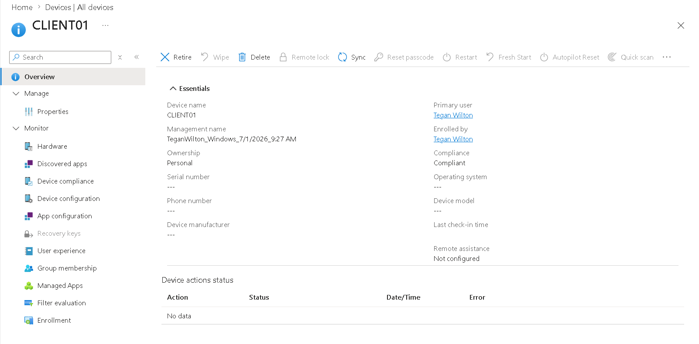
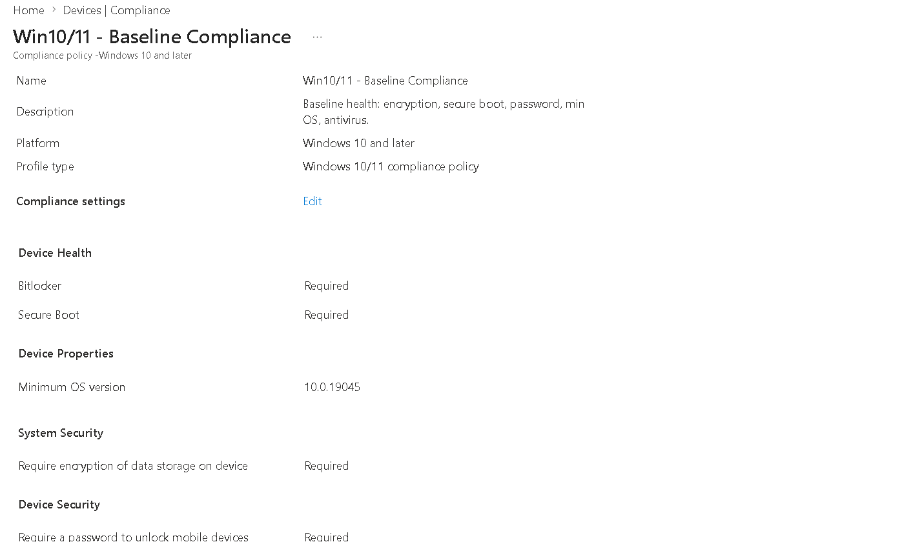
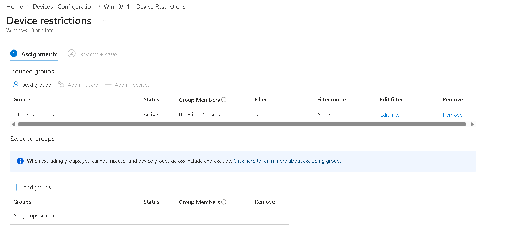
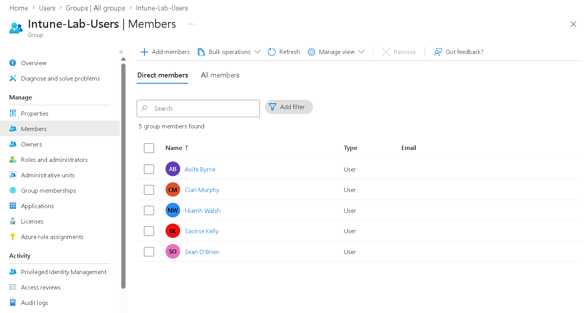
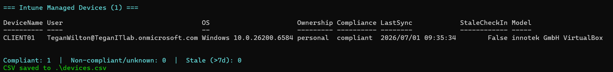

# ☁️ Microsoft 365 & Intune — Endpoint Management Lab

Managing a fleet of Windows devices the modern way: **Microsoft Intune** (MDM) and **Entra ID** for
identity, configured and reported **as code** with the Microsoft Graph PowerShell SDK — not just
clicking around the admin center.

> The point of this repo: cloud endpoint management is where IT support is going. This shows I can
> enrol devices, push compliance and configuration baselines, manage cloud identities, and report on
> the fleet — and automate all of it with PowerShell instead of doing it by hand.

---

## 🎯 Skills demonstrated
`Microsoft Intune` · `Mobile Device Management (MDM)` · `Microsoft Entra ID (Azure AD)` ·
`Microsoft 365` · `Microsoft Graph PowerShell` · `Compliance policies` · `Configuration profiles` ·
`Conditional Access (concept)` · `Windows Autopilot / enrolment` · `PowerShell` · `Automation`

---

## 📜 The scripts

| Script | What it does | Changes? |
|--------|--------------|----------|
| **Connect-IntuneGraph.ps1** | Shared sign-in helper — connects to Microsoft Graph with the scopes a script needs, and reuses the session if it's already connected. | — |
| **New-EntraUsersAndGroups.ps1** | Bulk-creates Entra ID cloud users from `users.csv` and adds them to a security group (the cloud version of my [AD Home Lab](../ad-home-lab) bulk-user script). | ✏️ writes |
| **New-IntuneCompliancePolicy.ps1** | Creates a Windows 10/11 **compliance policy** (BitLocker, Secure Boot, password, min OS, antivirus) and can assign it to a group. | ✏️ writes |
| **New-IntuneConfigProfile.ps1** | Creates a Windows 10/11 **device-restrictions profile** (password + encryption hardening) and can assign it. | ✏️ writes |
| **Get-IntuneDeviceReport.ps1** | **Read-only** inventory of every enrolled device — owner, OS, compliance, last check-in — to console / CSV / HTML; flags non-compliant and stale devices. | read-only |

---

## 🧠 Compliance vs configuration — the concept
- A **compliance policy** *checks* a device against rules (is BitLocker on? is the OS recent?). A failing
  device is marked **non-compliant** — which **Conditional Access** can then use to block it from
  company data. It reports; it doesn't change the device.
- A **configuration profile** *sets* things on the device (password rules, encryption, restrictions).
  It changes the device.

You use them together: configure the baseline, then prove (and enforce) it with compliance.

---

## ▶️ How to run
```powershell
# 1. Install the Microsoft Graph SDK (once)
Install-Module Microsoft.Graph -Scope CurrentUser

# 2. Allow scripts for this session only
Set-ExecutionPolicy -Scope Process -ExecutionPolicy Bypass

# 3. Read the built-in help for any script
Get-Help .\scripts\Get-IntuneDeviceReport.ps1 -Full

# 4. Create cloud users + a group, then a compliance policy targeting that group
.\scripts\New-EntraUsersAndGroups.ps1 -CsvPath .\scripts\users.csv
$g = (Get-MgGroup -Filter "displayName eq 'Intune-Lab-Users'").Id
.\scripts\New-IntuneCompliancePolicy.ps1 -GroupId $g
.\scripts\New-IntuneConfigProfile.ps1   -GroupId $g

# 5. See what's enrolled
.\scripts\Get-IntuneDeviceReport.ps1 -CsvPath .\devices.csv
```
> You need a Microsoft 365 tenant with Intune. A **free Microsoft 365 Developer tenant** (or a 30-day
> Business Premium / EMS E5 trial) works perfectly — full setup, including enrolling a Windows VM, is
> in **[docs/setup-guide.md](docs/setup-guide.md)**.

---

## 🛡️ Safe by design
- `Get-IntuneDeviceReport.ps1` is **read-only**.
- The three `New-*` scripts support **`-WhatIf`** (preview what would be created before committing) and
  create policies **unassigned** unless you explicitly pass `-GroupId`.
- No tenant IDs, secrets or tokens are committed — see `.gitignore`. Sign-in is interactive via Graph.
- Every script has **comment-based help**: `Get-Help .\scripts\<name>.ps1 -Full`.

---

## 📸 Screenshots
> Captured against a Microsoft 365 Developer tenant with Intune. (Add yours after running the steps in
> [docs/setup-guide.md](docs/setup-guide.md).)

**Enrolled device in Intune** — a Windows 11 client enrolled and managed:



**Compliance policy** — the Win10/11 baseline created by `New-IntuneCompliancePolicy.ps1`:



**Configuration profile** — device-restrictions baseline assigned to the lab group:



**Entra ID users + group** — cloud users created in bulk by `New-EntraUsersAndGroups.ps1`:



**Device report** — `Get-IntuneDeviceReport.ps1` listing the fleet with compliance state:


